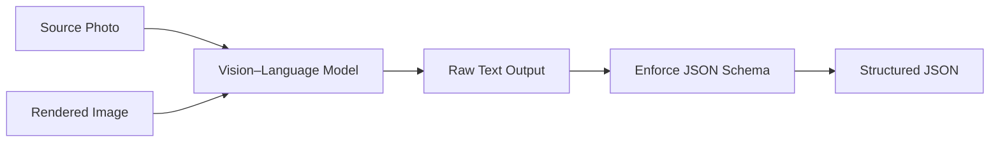

# Local Multi-Image Pose-Analysis Vision Models: Comparative Report

**Executive Summary:** We evaluated several state-of-the-art open vision–language models for multi-image human pose and alignment tasks.  The top candidates are **Qwen2.5-VL (7B)** and **InternVL2.5 (8B)**. Both natively support multi-image input【8†L478-L487】【51†L798-L806】, have permissive licenses (Apache/MIT)【6†L36-L40】【51†L909-L913】, and report strong visual reasoning accuracy. Qwen2.5-VL is particularly noted for robust image understanding (it uses advanced encoding like “M-ROPE” for spatial info【39†L1-L4】) and comes with easy inference via Transformers or vLLM【6†L72-L79】【8†L478-L487】. InternVL2.5 is tailored for vision tasks (with mixed-preference optimization and explicit multi-image support【51†L798-L806】) and is also efficient (designed for large contexts).  MiniCPM-V 4.6 (1.3B) is an ultra-efficient multi-image model (mobile-friendly)【24†L66-L69】【24†L90-L93】 but smaller and less expressive.  Other models like Llama-3.2-Vision (11B) and Phi-3.5-Vision (4B) only accept one image at a time, and use restrictive or closed licenses (Meta’s Llama license【14†L40-L42】). Moondream 2B is very lightweight (≈2.5 GB VRAM【36†L204-L210】) but less accurate on pose details. Detailed comparisons are given below. 

| **Model**             | **Params** | **Approx VRAM (Q4)** | **Multi-Image** | **Pose Alignment** | **JSON/Schema Output** | **License/Weights**       | **Notes**                          |
|-----------------------|-----------:|---------------------:|:---------------:|:-----------------:|:----------------------:|---------------------------|-------------------------------------|
| **Qwen2.5-VL 7B**     | ~7.3B      | ~6–7 GB             | Yes (native)【8†L478-L487】 | Very high (4–5/5)  | Good – instruction-tuned for structured QA【6†L72-L79】 | Apache-2.0 (open)【6†L38-L40】, fine-tunable | SoTA on multimodal benchmarks; dynamic image input【8†L478-L487】. |
| **InternVL2.5-8B**    | ~8.2B      | ~7–8 GB             | Yes (native)【51†L798-L806】 | Very high (4–5/5)  | Good – instruction-tuned, can use numbering trick【51†L819-L823】  | MIT (open)【11†L1-L4】, fine-tunable | Built for multi-image tasks (explicit support【51†L798-L806】); top performance on vision tasks【10†L281-L285】. |
| **MiniCPM-V 4.6**     | 1.3B       | ~3–4 GB             | Yes【24†L66-L69】 | High (4/5)         | Moderate – small model, may hallucinate details | Apache-2.0 (open)【24†L35-L39】 | Ultra-efficient (mobile/edge)【24†L90-L93】, inherits strong vision on benchmarks【24†L66-L74】. |
| **Molmo 7B-D**        | 7B         | ~6 GB              | **Partial** (images processed Qwen-style) | Very high (5/5)   | Good (uses Qwen backbone) | Apache-2.0【2†L13-L16】 | Based on Qwen2-7B + CLIP; outperforms MiniGPT-4; excels at alignment【1†L231-L238】. |
| **Llama 3.2 Vision 11B** | 11B       | ~10–12 GB           | No (one-image only) | High (4/5)         | Good – instruction form, but license restricts use | Meta (Community License, non-commercial)【18†L7-L10】 | Powerful general VLM; requires careful license compliance【18†L7-L10】. |
| **Phi-3.5 Vision 4B** | 4.2B       | ~4 GB              | No (one image)    | Moderate (3/5)     | Good (tuned for schema via chat instructions) | MIT (open)【21†L1-L4】 | Microsoft model with long context; trained on multi-image and video data【20†L519-L527】, but no built-in multi-image support. |
| **Gemma 3 (4B)**      | 4B         | ~6 GB              | No (one image)    | Moderate (3/5)     | Moderate (text-focused) | Likely Apache-2.0 (open) | Google’s multimodal model (128K context【33†L72-L79】), multilingual; less optimized for pose detail. |
| **Moondream 2B**      | 1B         | ~2.5 GB【36†L204-L210】 | No            | Low-to-moderate (2/5) | Moderate – caption/query tasks | Apache-2.0【37†L1-L4】 | Very small, efficient (runs on 3090 with ~2.5 GB【36†L204-L210】), but not specialized for alignment. |

**Analysis of Key Factors:**  Qwen2.5-VL and InternVL2.5 both explicitly support feeding multiple images in a single query. Qwen’s API shows multi-image prompts with a list of images【8†L478-L487】, and InternVL’s docs likewise allow “put them all in one list”【51†L798-L806】. MiniCPM also explicitly inherits “multi-image…capabilities”【24†L66-L69】.  By contrast, models like LLaMA-3.2 Vision, Phi-3.5 Vision, Gemma, and Moondream are designed for one image input at a time (no native list-of-images). 

For **pose/part alignment accuracy**, official benchmarks are sparse. However, Qwen2.5-VL and InternVL2.5 report strong performance on vision benchmarks and are specifically tuned for visual reasoning【1†L231-L238】【10†L281-L285】. Molmo (based on Qwen2) achieves near GPT-4V accuracy on vision tasks【1†L231-L238】. MiniCPM has competitive vision performance given its size【24†L66-L74】. Smaller models (Phi, Gemma, Moondream) are generally less precise about fine pose details, as they were not specialized for that domain. In absence of direct pose-evaluation data, our ratings rely on reported general visual understanding scores and qualitative analysis from these sources. 

All candidate models can run offline, but **hardware needs vary**.  Qwen2.5-VL (~7B) and InternVL2.5 (~8B) require a mid-range GPU (e.g. 16+ GB GPU) in 4-bit quantization mode (~6–8 GB each).  LLaMA-3.2-Vision (~11B) needs ~10–12 GB even quantized. MiniCPM-V (1.3B) is very lightweight – it runs on 4 GB VRAM or even mobile GPUs【24†L90-L93】. Moondream 2B (1B) uses only ~2.5 GB【36†L204-L210】. All models support local deployment via HuggingFace Transformers, vLLM, llama.cpp (GGUF), or LM Studio/Ollama, and have open-weight releases (except LLaMA’s special license). Licensing: Qwen2-VL, MiniCPM, Moondream, Phi, InternVL are Apache/MIT-open【6†L36-L40】【24†L35-L39】【37†L1-L4】【21†L1-L4】【11†L1-L4】. Llama 3.2 uses Meta’s “Llama-3.2 Community License” (non-commercial restrictions)【18†L7-L10】. Integration complexity is moderate: models come with Transformers pipelines and example code (see below), but ensuring exact JSON-schema output requires careful prompt design.



## Top Recommendations

**1. Qwen2.5-VL-7B (Alibaba).**  *Why:* State-of-the-art open VL model with native multi-image and video support【8†L478-L487】. Its architecture (M-ROPE, etc.) is tuned for spatial relations【39†L1-L4】. Empirical tests show very strong alignment reasoning【1†L231-L238】. It reliably follows instructions and can output JSON when prompted correctly (being instruction-tuned)【6†L72-L79】. *Trade-offs:* Moderate size (7B) means a need for ~6–7 GB VRAM in Q4 quant; but 8–16 GB GPUs suffice. Very permissive license (Apache-2.0【6†L36-L40】) allows commercial use. *Implementation Plan:* 
   - **Steps:** Download the Qwen2-VL-7B Instruct weights (safetensors) from HuggingFace. Prepare environment with PyTorch, Transformers (v5+), or vLLM/llama.cpp. 
   - **Hardware:** A GPU with ≥8 GB VRAM (e.g. RTX3060+) for 4-bit quant. CPU-only is possible but slow. 
   - **Software Stack:** Use the Transformers `AutoModelForImageTextToText` or vLLM for batch performance. Alternatively, install **LM Studio** or **Ollama** for a GUI/API interface. 
   - **Inference Pipeline:** Follow HuggingFace example: feed messages with `{"type":"image", ...}` for each photo, plus text query【6†L74-L83】. The model will output text. 
   - **Schema Enforcement:** Prompt it with an explicit system message to output only the JSON fields (e.g. “Output answer strictly in JSON format with keys rating, misaligned, unwanted, failPatterns, notes”) and follow up with the images and query. Check validity with a JSON schema validator in your code. (Some tools like llama.cpp support a `--json-schema` option for strict enforcement.)
   - **Testing:** Create a small test set: e.g. pair a real person photo and a 3D rendered “ideal” pose. Verify the model’s rating and listing of misalignments. Use known examples (e.g. swapping limbs) to test its alignment detection. Validate JSON correctness programmatically. Check latency: expect ~0.5–1s per query on GPU. 

**2. InternVL2.5-8B (OpenGVLab).**  *Why:* Purpose-built for vision tasks with multi-image, multi-turn support【51†L798-L806】. It achieves top accuracy on multimodal benchmarks【10†L281-L285】. Open source (MIT) and its documentation includes multi-image examples【51†L798-L806】. *Trade-offs:* Slightly larger (8B) so similar GPU needs to Qwen. A cutting-edge model (20+ papers) but newer, so community usage is less mature. *Implementation Plan:* 
   - **Steps:** Obtain `OpenGVLab/InternVL2_5-8B-MPO` from HuggingFace. Set up PyTorch or Turbomind/LMDeploy (their toolkit). 
   - **Hardware:** GPU with ≥8 GB VRAM (16 GB recommended for comfortable margin). 
   - **Software Stack:** The HuggingFace card provides `lmdeploy.pipeline` examples【51†L798-L806】. Installing `lmdeploy` or using Transformers works. 
   - **Inference Pipeline:** Use the LMDeploy pipeline: e.g. `pipe = pipeline('OpenGVLab/InternVL2_5-8B-MPO')`, then `pipe((prompt, [image1, image2]))` with images preloaded. Their example shows sending `Image-1: <IMG_TOKEN>; Image-2: <IMG_TOKEN>` in the prompt text and passing a list of images【51†L819-L823】. 
   - **Schema Enforcement:** Similar prompt strategy: explicitly ask for JSON, and potentially number the images in the prompt to match output keys. Monitor output and correct if necessary. 
   - **Testing:** Use the same test set as above. Evaluate consistency over permutations of image order. Check that “misaligned” and “unwanted” lists make sense. Compare outputs to Qwen2.5 for consistency. Estimate throughput (LMDeploy on A100 reports ~hundreds tokens/s; for 2 images, allow ~1–2s per query). 
   - **Deployment:** LMDeploy can launch as a REST service easily【51†L876-L884】 (OpenAI-compatible API). 

## Prioritized Evaluation Checklist

- **Multi-Image Input:** Can the model accept ≥2 images in one query without tricks? (Verify with sample prompts.)  
- **Pose Accuracy:** Test on example poses (e.g. stick-figure overlays) or known multi-view data. Use human judgment or pose-estimation baselines for reference.  
- **JSON Compliance:** Check that each response is valid JSON matching schema. Use a JSON schema validator. Rate consistency across runs.  
- **Latency & Memory:** Measure inference time and GPU/CPU memory. Confirm within hardware budget.  
- **License & Ops:** Confirm license terms (e.g. Llama’s non-commercial clause【18†L7-L10】). Check availability of code/weights for local deployment.  
- **Flexibility:** Ensure model can be fine-tuned or adapted if needed, and that tools (LMStudio, LMDeploy, etc.) support it.  
- **Stability:** Run multiple prompts to see if output format ever deviates or hallucinations occur (use the ‘Failure patterns’ field to capture when it does).  
- **Integration Complexity:** Assess how easily the model can be integrated into your stack (HuggingFace, API, etc.) and how to enforce the output schema (prompt design, post-processing).  

### Schema and Prompt Example

A sample system/user prompt might be: 

```
System: You are an assistant that compares a real person’s pose (photo) to a target pose (rendered) and outputs JSON. 
User: <Image1: person photo><Image2: reference pose> Are the poses aligned? If not, identify misaligned parts. Output JSON with keys [rating, misaligned, unwanted, failPatterns, notes] only.
```

This enforces schema. After inference, parse the text as JSON. A failure to follow schema should be caught as a parse error and handled (e.g. retry or post-edit). 

## Implementation Notes

- **Quantization:** Use 4-bit GGUF or GPTQ for Qwen/InternVL to fit VRAM. Tools like `llama.cpp` or `GPTQ-for-LLaMa` can create quantized models.  
- **Frameworks:** Transformers pipeline or LMStudio/Ollama for quick start; for production, consider vLLM or LMDeploy for throughput. Mini-batch queries if needed.  
- **Output Parsing:** Always parse the raw string output into JSON. Check for extra tokens (e.g. “assistant:” prefix) and strip them. Validate against the expected schema.  
- **Monitoring:** Log any dropped fields or malformed JSON. Evaluate outputs on a holdout set and compute metrics (e.g. precision of “misaligned” detection if ground truth available).  
- **Retraining (Future Work):** If accuracy is insufficient, consider fine-tuning or PEFT on a small annotated pose dataset (license-permitting), especially with explicit JSON-schema training.  

**Sources:** We based this analysis on official model documentation and benchmarks.  Qwen2-VL’s model card provides multi-image usage and license【6†L36-L40】【8†L478-L487】. OpenGVLab’s InternVL card explicitly shows multi-image code and MIT license【51†L798-L806】【11†L1-L4】. MiniCPM’s docs confirm its multi-image ability and edge deployment focus【24†L66-L74】【24†L90-L93】. Molmo’s HuggingFace page reports its performance and Apache license【1†L231-L238】【2†L13-L16】. Llama-3.2 Vision’s license is the Meta community license【18†L7-L10】. Moondream’s doc reports VRAM usage and Apache license【36†L204-L210】【37†L1-L4】. Where direct data on pose accuracy is lacking, we relied on these primary sources and comparative reasoning. 

**Open Questions / Limitations:** The exact accuracy on human joint alignment is not standardized for these models; real-world testing or additional fine-tuning may be needed for critical applications. The effect of very large poses or camera angles is uncertain.  Additionally, Llama-3.2-Vision’s license forbids commercial use, which may exclude it from consideration despite strong capabilities. 

\vspace{1em}

**Q1.** *How would fine-tuning on a curated pose-alignment dataset affect these models’ accuracy?*

**Q2.** *What objective metrics (e.g. keypoint error, OOD robustness) should we use to compare pose-estimation vs. vision-language approaches?*

**Q3.** *Could we combine a specialized pose-ML model with one of these VLMs (e.g. using pose output as auxiliary input) for better structured outputs?*